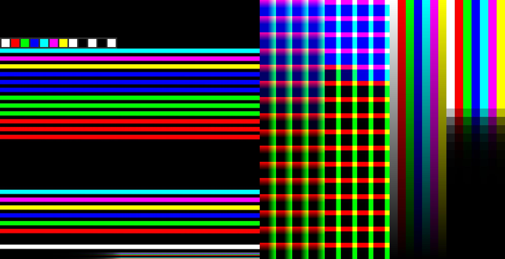

# CLFTestImage
 Test Image for CLF Evaluation and Development

Mostly a discussion point at the moment.

The ramps and the bottom shown in 3D space.

The intent here is to cover as much of the possible half float range, both positive and negative, using half float style quantization.

Since the fist CLF inmplementation meeting, a number of features have been added.

*Subnormal value row in the full float range ramps.
*Full range float ramps now cover full positive a negative spaces.
*Cube has been expanded to 64x64, but not covers negative space, so no precision has been gained.
*WRGBCYM 0.0 -> 1.0 ramps
*WRGBCYM 0.18 -15 to +15 stops patch ramps
*Selection of easy to sample patch squares W,R,G,B,C,M,Y,inf,-inf,nan,0,65504. (should probably be expanded on).

3D visualization of the full float range cube.
