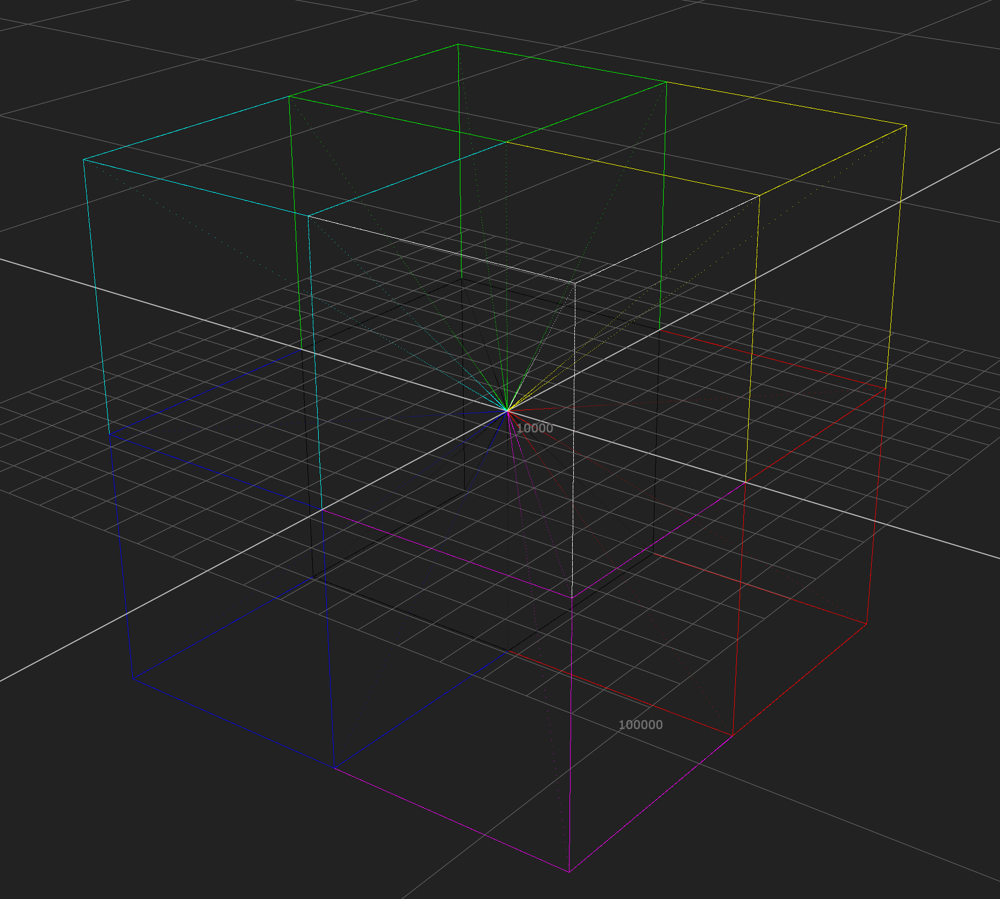

# CLFTestImage
 Test Image for CLF Evaluation and Development

Mostly a discussion point at the moment.

The ramps and the bottom shown in 3D space.

The intent here is to cover as much of the possible half float range, both positive and negative, using half float style quantization.

Since the fist CLF inmplementation meeting, a number of features have been added.

* Subnormal value row in the full float range ramps.
* Full range float ramps now cover full positive a negative spaces.
* Cube has been expanded to 64x64, but not covers negative space, so no precision has been gained.
* WRGBCYM 0.0 -> 1.0 ramps
* WRGBCYM 0.18 -15 to +15 stops patch ramps
* Selection of easy to sample patch squares W,R,G,B,C,M,Y,inf,-inf,nan,0,65504. (should probably be expanded on).

# 15 Sep 2021

Removed NaN and Inf example Pixels from bottom left.

# 25 Aug 2020

General script tidy up, not functional changes.

# Description:

## Creations date
This section is simply a data stamp to make it easier to diferentiate versions of the image created at different times.

## Image is composed of the following subsections

## 33x33 Cubes

There are two 33x33 cubes here.
The one on the bottom runs from -1.0 to 1.0
The one on the top runs from -65504 to 65504

## Macbeth

This is a miniature Macbeth in ACES2065-1, based on the colourscience.org values

## Grey Ramps

This is a set of 0 -> 1 greyscale ramps.

Linear
* sRGB
*Gamma 2.2
*Gamma 2.4
*Gamma 2.6
*ST.2084

## Pure Ramps + Macbeth Ramps

This is a set of pure macbeth patches in 1/2 stop increments.

Each patch is 16x4 pixels, with the 1.0 patch's bottom corner starting at x=496 y=225

## Spiderweb

This is a set of Ramps designed to generate a spiderweb whe viewed on a vector scope.

## Extents Lattice

This section of ramps is designed to produce a bounding box around all possible normal positive and negative values when viewed in 3D.

