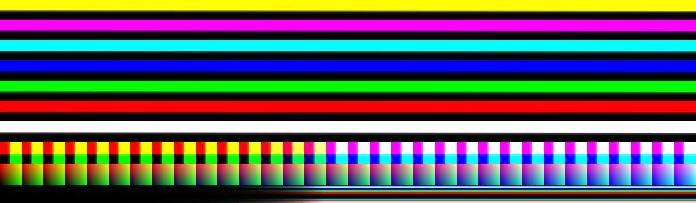

# CLFTestImage
 Test Image for CLF Evaluation and Development

Mostly a discussion point at the moment.

The ramps and the bottom shown in 3D space.

The intent here is to cover as much of the possible half float range, both positive and negative, using half float style quantization.